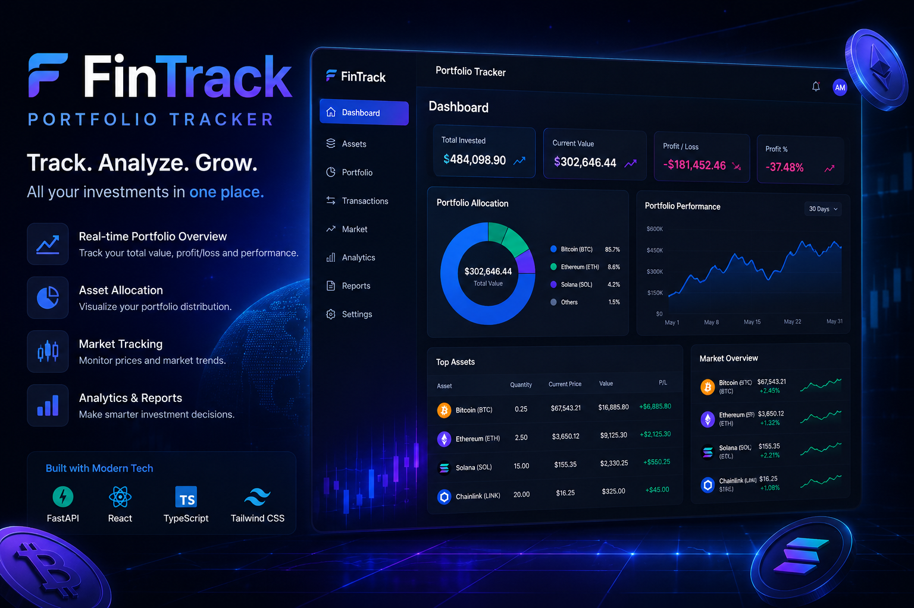

<p align="center">
  
</p>
---------------
# 🚀 FinTrack

A modular investment portfolio management platform built with **FastAPI** and **React**.

FinTrack helps users manage digital assets, record transactions, track portfolio performance, and analyze investments through a modern dashboard.

---

# ✨ Features

## 💰 Asset Management

- ✅ Create new assets
- ✅ View all assets
- ✅ Delete assets
- ✅ Search assets by symbol

---

## 📊 Transaction Management

- ✅ Create BUY / SELL transactions
- ✅ Track transaction history
- ✅ Calculate transaction value
- ✅ Delete transactions
- ✅ Validate asset balance before selling

---

## 📈 Portfolio Tracking

- ✅ Calculate current holdings
- ✅ Calculate average buy price
- ✅ Track current portfolio value
- ✅ Calculate profit / loss

---

## 📉 Analytics Dashboard

- ✅ Total invested amount
- ✅ Current portfolio value
- ✅ Profit and loss calculation
- ✅ Profit percentage

---

# 🛠 Tech Stack

## Backend

- 🐍 Python
- ⚡ FastAPI
- 📦 Pydantic
- 🔄 Async API architecture
- 📁 JSON based persistence


## Frontend

- ⚛️ React
- ⚡ Vite
- 🟦 TypeScript
- 🎨 Tailwind CSS
- 🔄 React Query
- 🌐 Axios
- 🧭 React Router


---

# 📂 Project Structure


FinTrack/
├── |── app/
│   |   |
│   │   ├── core/
│   │   │   └── configuration/
│   │   │
│   │   ├── modules/
│   │   │   ├── assets/
│   │   │   │   ├── api.py
│   │   │   │   ├── service.py
│   │   │   │   ├── repository.py
│   │   │   │   ├── models.py
│   │   │   │   └── schemas.py
│   │   │   │
│   │   │   ├── transactions/
│   │   │   │   ├── api.py
│   │   │   │   ├── service.py
│   │   │   │   ├── repository.py
│   │   │   │   ├── models.py
│   │   │   │   └── schemas.py
│   │   │   │
│   │   │   ├── portfolio/
│   │   │   │
│   │   │   └── analytics/
│   │   │
│   │   └── main.py
│   │
│   └── data/
│       ├── assets.json
│       └── transactions.json
│
├── frontend/
│   ├── src/
│   │   ├── api/
│   │   ├── components/
│   │   ├── pages/
│   │   ├── routes/
│   │   ├── types/
│   │   └── App.tsx
│   │
│   ├── package.json
│   └── vite.config.ts
│
└── README.md


---

# ⚙️ Installation

## Backend Setup

Enter backend folder:

```bash
cd backend

Create virtual environment:

python -m venv venv

Activate:

Windows:

venv\Scripts\activate

Install dependencies:

pip install -r requirements.txt

Run server:

uvicorn app.main:app --reload

Backend runs on:

http://127.0.0.1:8000

Frontend Setup

Enter frontend folder:

cd frontend

Install packages:

npm install

Run development server:

npm run dev

Frontend runs on:

http://localhost:5173
🔌 API Documentation

🔌 API Documentation

FastAPI provides automatic documentation:

Swagger:

http://127.0.0.1:8000/docs
🔒 Security Notes

This project is a local development application.

Before publishing:

❌ Do not upload .env files
❌ Do not upload API keys
❌ Do not upload passwords
❌ Do not upload personal data
❌ Do not upload database files containing private information

Use .gitignore for sensitive files.

🚀 Future Improvements
Authentication system
Database integration
Cloud deployment
Advanced charts
User accounts
Real-time market data
